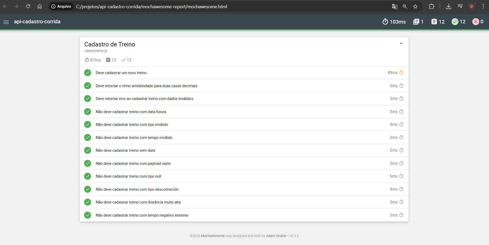

# API Cadastro de Treinos de Corrida

API REST desenvolvida com Node.js e Express para cadastro de treinos de
corrida, com foco em qualidade, testes automatizados e boas práticas de
arquitetura.

------------------------------------------------------------------------

## Tecnologias utilizadas

-   Node.js
-   Express
-   Mocha
-   Chai
-   Supertest
-   Swagger (swagger-ui-express, swagger-jsdoc)

------------------------------------------------------------------------

## Estrutura do projeto
    docs/
     └── report.png

    src/
     ├── app.js
     ├── server.js
     ├── routes/
     │    └── treinos.routes.js
     ├── controllers/
     │    └── treinos.controller.js
     ├── services/
     │    └── treinos.service.js
     ├── validations/
     │    └── treinos.validation.js
     └── config/
          └── swagger.js
          
    tests/
     └── treino.js

     
    

     

------------------------------------------------------------------------

## Objetivo

Construir uma API aplicando:

-   Test Driven Development (TDD)
-   Validação de regras de negócio
-   Padronização de respostas
-   Organização em camadas (Controller, Service, Validation)
-   Documentação interativa com Swagger

------------------------------------------------------------------------

## Como executar o projeto

### 1. Clonar o repositório

``` bash
git clone https://github.com/danielleblima/api-cadastro-corrida
cd api-cadastro-corrida
```

### 2. Instalar dependências

``` bash
npm install
```

### 3. Executar a API

``` bash
node src/server.js
```

Servidor disponível em:

    http://localhost:3000

------------------------------------------------------------------------

## 📄 Documentação da API

Swagger disponível em:

    http://localhost:3000/api-docs

Permite testar os endpoints diretamente pelo navegador.

------------------------------------------------------------------------

## Executar testes

``` bash
npx mocha tests
```

------------------------------------------------------------------------

## Endpoint principal

### POST /treinos

Cria um novo treino de corrida.

### Exemplo de request:

``` json
{
  "data": "2026-04-14",
  "distanciaKm": 5,
  "tempoMin": 30,
  "tipo": "corrida",
  "intensidade": "moderada",
  "observacao": "treino leve"
}
```

------------------------------------------------------------------------

## Validações implementadas

-   Campos obrigatórios
-   Payload vazio
-   Tipos inválidos (null, string incorreta)
-   Data futura
-   Tipo de treino inválido
-   Tempo e distância inválidos
-   Limites de valores

------------------------------------------------------------------------

## Regras de negócio

-   Cálculo automático do ritmo (`min/km`)
-   Arredondamento para 2 casas decimais
-   Identificador incremental
-   Data de criação automática

------------------------------------------------------------------------

## Relatório de Testes



------------------------------------------------------------------------

## Estratégia de testes

Testes automatizados cobrindo:

-   Cenários positivos
-   Validações de entrada
-   Casos de erro
-   Regras de negócio

------------------------------------------------------------------------

## Melhorias futuras

-   Persistência em banco de dados
-   Autenticação (JWT)
-   Novos endpoints (GET, DELETE, PUT)
-   Cobertura de testes com relatório
-   Validação com Joi ou Zod

------------------------------------------------------------------------

## Autora

Danielle Lima

------------------------------------------------------------------------

## Observação

Este projeto foi desenvolvido com foco em prática de QA, testes
automatizados e arquitetura backend.
